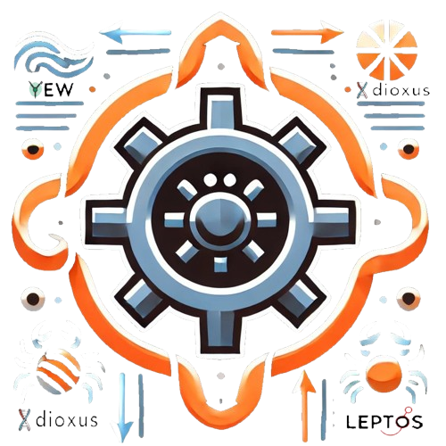

# 🖱️ Scroll-RS

## 🎬 Demo

## 📜 Intro

`Scroll-RS` is a headless, customizable scroll-to-target component for Wasm-based frameworks like **Yew**, **Dioxus**, and **Leptos**. Enhance user experience by enabling smooth, controlled scrolling to specific positions on a page with optional auto-hide and custom styling.

## 🤔 Why Use Scroll-RS?

The following are some of the reasons why Scroll-RS is a great addition to your Wasm projects:

1. **← ↑ → ↓ Scroll Anywhere**: Easily navigate to specific sections or positions on the page.
1. **🎨 Fully Customizable**: Use your own CSS styles, animations, and SVG icons.
1. **⚡ Smooth Behavior**: Choose between smooth, instant, or delayed scrolling effects.
1. **👀 Auto-Hide**: Automatically hide or show based on user-defined thresholds.
1. **🔧 Flexible Offsets**: Adjust scrolling positions and delays with ease.

## Y Yew Usage

Refer to [our guide](YEW.md) to integrate this component into your Yew app.

## 🧬 Dioxus Usage

Refer to [our guide](DIOXUS.md) to integrate this component into your Dioxus app.

## 🤝 Contributions

Contributions are welcome! Whether it's bug fixes, feature requests, or examples, we would love your help to make Scroll-RS better.

1. Fork the repository.
1. Create a new branch for your feature/bugfix.
1. Submit a pull request for review.

## 📜 License

Scroll-RS is licensed under the [MIT License](LICENSE). You are free to use, modify, and distribute this library in your projects.
