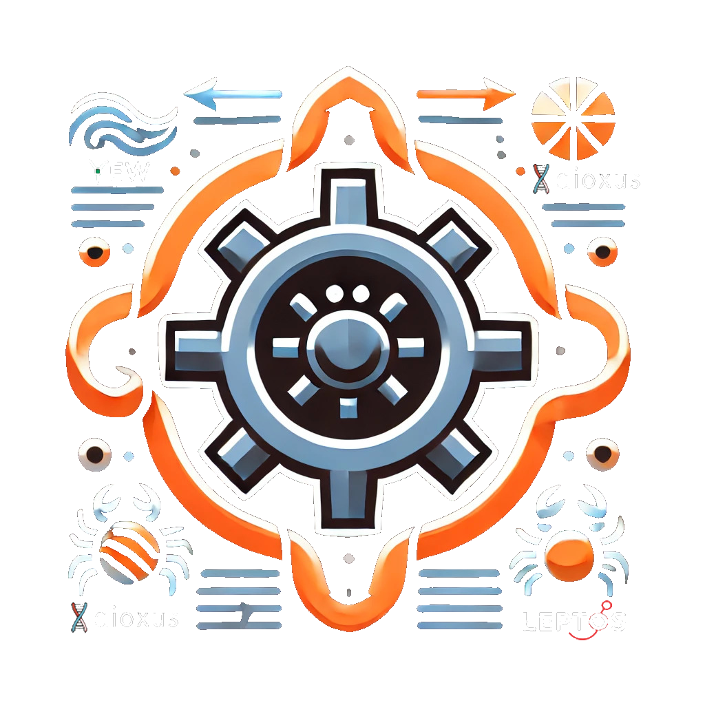

<div align="center">

# 🖱️ Scroll-RS

[](https://crates.io/crates/scroll-rs)
[](https://crates.io/crates/scroll-rs)

[](https://www.rust-lang.org/)
[](https://www.rust-lang.org)
[](https://github.com/wiseaidev)

[](https://discord.gg/b5JbvHW5nv)



</div>

## 🎬 Demo


## 📜 Intro

`Scroll-RS` is a headless, customizable scroll-to-target component for Wasm-based frameworks like **Yew**, **Dioxus**, and **Leptos**. Enhance user experience by enabling smooth, controlled scrolling to specific positions on a page with optional auto-hide and custom styling.

## 🤔 Why Use Scroll-RS?

The following are some of the reasons why Scroll-RS is a great addition to your Wasm projects:

1. **← ↑ → ↓ Scroll Anywhere**: Easily navigate to specific sections or positions on the page.
1. **🎨 Fully Customizable**: Use your own CSS styles, animations, and SVG icons.
1. **⚡ Smooth Behavior**: Choose between smooth, instant, or delayed scrolling effects.
1. **👀 Auto-Hide**: Automatically hide or show based on user-defined thresholds.
1. **🔧 Flexible Offsets**: Adjust scrolling positions and delays with ease.

## ⚙️ Yew Installation

Adding Scroll-RS to your project is simple:

1. Ensure your project is set up with a Wasm-based framework like **Yew**. Refer to their [Getting Started Guide](https://yew.rs/docs/getting-started/introduction) for setup instructions.

1. Add `scroll-rs` to your dependencies:

   ```sh
   cargo add scroll-rs --features=yew
   ```

1. Import `Scroll` into your component and start enhancing your app's scroll functionality.

## 🛠️ Usage

Below is an example of how to integrate `Scroll-RS` into your Yew app:

```rust
use scroll_rs::yew::{Behavior, Scroll};
use yew::prelude::*;

#[function_component(Home)]
pub fn home() -> Html {
    html! {
        <div class="min-h-screen bg-gray-900 text-white p-8">
            <h1 class="text-4xl font-bold text-center mb-8">{ "Scroll-RS Demo" }</h1>
            
            // Scrollable content
            <div id="top" class="h-96 bg-gray-700 p-8 text-center">
                <h2 class="text-3xl font-bold">{ "Top of the Page" }</h2>
                <p>{ "Scroll down to see buttons in action!" }</p>
            </div>
            
            <div id="bottom" class="h-96 bg-gray-800 p-8 text-center">
                <h2 class="text-3xl font-bold">{ "Bottom of the Page" }</h2>
                <p>{ "You reached the bottom!" }</p>
            </div>

            // Scroll components
            <Scroll
                style="position: fixed; bottom: 2rem; right: 2rem; background: #10B981; padding: 1rem; border-radius: 50%;"
                content={html! { <span>{"↑"}</span> }}
                scroll_id="top"
            />
            <Scroll
                style="position: fixed; bottom: 2rem; left: 2rem; background: #F59E0B; padding: 1rem; border-radius: 50%;"
                content={html! { <span>{"↓"}</span> }}
                scroll_id="bottom"
            />
        </div>
    }
}
```

## 🔧 Props

| Property       | Type              | Description                                                        | Default           |
|----------------|-------------------|--------------------------------------------------------------------|-------------------|
| `style`        | `&'static str`    | Inline CSS styles for the scroll button.                          | Default styling   |
| `class`        | `&'static str`    | Custom CSS classes for styling the button.                        | None              |
| `content`      | `Html`            | Custom content (HTML/SVG) for the scroll button.                  | Default SVG       |
| `behavior`     | `Behavior`        | Scrolling behavior: `Smooth`, `Instant`.                          | `Smooth`          |
| `top`          | `f64`             | Target top position for scrolling.                                | `0.0`             |
| `left`         | `f64`             | Target left position for scrolling (horizontal scrolling).         | `0.0`             |
| `offset`       | `f64`             | Offset to apply when scrolling to the target position.            | `0.0`             |
| `delay`        | `u32`             | Delay (in ms) before initiating the scroll.                       | `0`               |
| `auto_hide`    | `bool`            | Whether to hide the button automatically based on scroll position.| `true`            |
| `threshold`    | `f64`             | Scroll threshold to determine button visibility.                  | `20.0` px         |
| `update_hash`  | `bool`            | Whether to update the URL hash during scrolling.                  | `true`            |
| `show_id`      | `&'static str`    | ID of the target element for the scroll button visibility logic.  | None              |
| `scroll_id`    | `&'static str`    | ID of the target container to scroll to.                          | None              |

## 🤝 Contributions

Contributions are welcome! Whether it's bug fixes, feature requests, or examples, we would love your help to make Scroll-RS better.

1. Fork the repository.
1. Create a new branch for your feature/bugfix.
1. Submit a pull request for review.

## 📜 License

Scroll-RS is licensed under the [MIT License](LICENSE). You are free to use, modify, and distribute this library in your projects.
